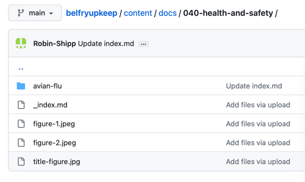

# Files and Folders

Before getting into the detail of how to produce content for a document like this, it is important to understand how that content is organised into files and folders, and how these are used to generate the navigation menus. At this point, it is not necessary to understand the contents of the files: that will be covered in later chapters.

As an example, we will look at the organisation of files and folders in the version of [*Belfry Upkeep*](https://belfryupkeep.cccbr.org.uk) current at the time of writing. 


The screenshots here are taken from the *Belfry Upkeep* repository on GitHub. This will be explained [later](../050-publication/#publishing-from-github).


## Single Level

*Figure 1: Belfry Upkeep repository top level*

For now, you can ignore all the files and folder shown in Figure 1, except for the folder called 'content'.

*Figure 2: The 'content' folder*

The 'content' folder (Figure 2) defines the content of the home page - the first page a reader will see on opening the document. The Markdown file '_index.md' contains the text of the page and 'up-holland-bells.jpg' is an image file (only one on this page). Note the folder 'docs'. This contains all the other chapters. 

*Figure 3: The 'docs' folder within 'content'*

As you can see in Figure 3, the 'docs' file contains a folder for each chapter. If you are familiar with *Belfry Upkeep* you will recognise the names.

As an example, Figure 4 shows the contents of the folder for the chapter on Bell Frames. 

*Figure 4: The 'bell-frames' folder within docs*

The Markdown file 'index.md' contains the text and there are seven .jpg files containing images. I will say more about the naming of image files in the chapter on [Images](../030-images/).

Please don't overthink the information in this chapter. All will become clear later. But you should take away the following points:

 - Note that I have adopted a style for the names of folders and files all to be in lower case, using a hyphen (-) to separate meaningful words. All of this material will finish up in a GitHub repository and GitHub is case-sensitive. This means that a mixture of upper and lower case can lead to unexpected errors. So I decided to use all lower case, including for email addresses and external links.
 - Note that the text of a chapter is always stored in an 'index' file, called 'index.md', or '_index.md' when the chapter includes a 'docs' folder - note the underscore (\_).
 - In Figure 3, you will see that I have prefaced each chapter name with a three-digit code. This does NOT determine the order in which the chapters appear in the navigation menu. We will come to that [later](../040-navigation-menus/). It is simply a way of making directory listings reflect the order of the chapters. The digits increase by ten to allow extra chapters to be inserted and there are three digits to allow for more than nine chapters.

## Multiple Level

This section is perhaps advanced for this early part of this document but it is convenient to cover it here. So far, we have regarded the content within a folder as a 'chapter'. In web terms, each chapter is a separate web page. But Hugo allows you to have 'sub-chapters' - effectively a chapter within a chapter, although both are still separate web pages. Figure 5 shows an example from *Belfry Upkeep*.

*Figure 5: A sub-chapter*

Figure 5 is part of the left-hand [navigation menu](../040-navigation-menus) (we will come to those soon). You will see that the 'Health & Safety' has a sub-chapter 'Avian Influenza' with the name indented. 

Figure 6 shows the contents of the 'Health & Safety' folder. 

*Figure 6: The contents of the Health and Safety chapter*

You will see that we have an '_index.md' file (with underscore) and an enclosed folder titled 'avian-flu'.

Figure 7 shows the contents of the enclosed folder which is somewhat boring, having only an 'index.md' file (no underscore) and no figures.

*Figure 7: The contents of the enclosed folder*


**Style Tip - Use of Sub-chapters:** In this case, an article on avian flu became available which was relevent to the Health & Safety but which, in terms of size and writing style, would have unbalanced the chapter. So the avian flu article was included as a sub-chapter, presented as an "Appendix" to the Health & Safety chapter. Two further examples can be found in the 'Stakeholder Engagement' and 'Contract Specification' chapters of [*Belfry Projects*](https://belfryprojects.cccbr.org.uk). Here, the original draft of each chapter split into two parts: the first with general guidance and the second with specific examples. The second parts were presented as sub-chapters, identified as 'addendums'.


## Disclaimer
 
*Whilst every effort has been made to ensure the accuracy of this information, neither contributors nor the Central Council of Church Bell Ringers can accept responsibility for any inaccuracies or for any activities undertaken based on the information provided.*

Version 0.1, August 2023

© 2023 Central Council of Church Bell Ringers
