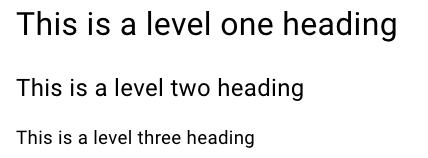
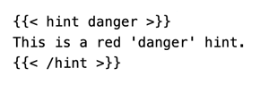
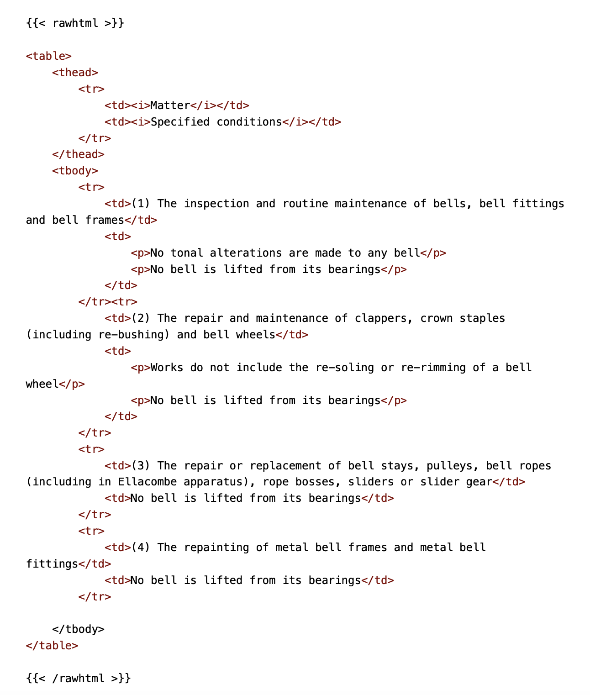

# Markdown

The basic text input to Hugo is in a scripting language called Markdown, described fully in [*The Markdown Guide*](https://www.markdownguide.org). This chapter provides a simple introduction – you will need to check the Markdown Guide for further options. Note that Markdown is text-based. It can be entered and edited using a code editor such as VS Code.

A warning and an apology for a rather long chapter. The use of Markdown is key to how Hugo works and you need to understand at least the basics at this stage.


Experience has shown that some syntax described in *The Markdown Guide* does not always work, or produces unexpected results. There is mention of 'different flavours' of Markdown which may explain this. If you want to do something slightly out of the ordinary you need to check the result before going public with it.



In the examples we will show the Markdown code and then how it is rendered in a browser. 
We can do this by indenting the code by one tab in the Markdown to make it render the code as written in a monospaced font against a light grey background. Alternatively, you can insert a line containing three back-ticks (```) before and after the code. Look up 'fenced code blocks' in [*The Markdown Guide*](https://www.markdownguide.org/extended-syntax/#fenced-code-blocks).


## Text and Paragraphs {#text-paragraphs}

Paragraphs are separated by at least one blank line. For example, the following code:

```
This is a paragraph.
Continuing here because there is no blank line

And this is another paragraph.
```

will render as:

This is a paragraph. Continuing here because there is no blank line.

And this is another paragraph.

## Headings


Headings are treated as paragraphs and you must put blank lines before and after a heading.


Headings are shown by placing one or more hashes (#) at the start of a line, followed by a space and a word or phrase. The number of hashes gives the level of the heading and Hugo renders the various levels differently. So the code:

```
# This is a level one heading

## This is a level two heading
	
### This is a level three heading
```

will render as:




We had to use a screenshot to show the rendering above, rather than letting Hugo generate it within this document. You will see later that Headings play a key part in defining the navigation menus. Having these extra headings within this document would have messed up the navigation menus.


## Emphasis

Surrounding text by various numbers of asterisks (*) provides italic, bold and bold italic text, as you can see from this code:

```
You can have *italic*, **bold** and ***bold italic***
```

which renders as:

You can have *italic*, **bold** and ***bold italic***


'Underline' is not suppported in Markdown. We am not sure why, although it may be to avoid confusion with hyperlinks. We find underlining rather ugly so we can live with this.


## Lists

Lists can be both unordered or ordered (that is, bullets or numbers).

### Unordered lists

Unordered lists have a dash and a space (- ) in front of each line item, with no blank line between items. You can indent items by four spaces or a tab to create a nested list. The code:

```
- First item
- Second item
	- Indented item
- Third item
```

will render as:

- First item
- Second item
	- Indented item
- Third item

### Ordered lists

Ordered lists have a number, a period and a space before each item (1. ), again with no blank line between items. The list must start with number one but, surprisingly, the remaining numbers can be random. To illustrate this, the code:

```
1. First item
9. Second item
	1. First indented item
	5. Second indented item
7. Third main item
```

will render as:

1. First item
9. Second item
	1. First indented item
	5. Second indented item
7. Third main item


You can nest an unordered list in an ordered list, or vice versa. We will spare you an example - try it for yourself.


## Tables

A table allows you to present information in rows and columns, with the cells separated by a 'pipe' character (|). It appears that the table must include two heading rows. As an example, the code:

```
| Figure | Subject |
| :---: | :--- |
| 1 | An English church in Summer |
| 2 | Another church, freezing in the depths of winter |
```

will render as:

| Figure | Subject |
| :---: | :--- |
| 1 | An English church in Summer |
| 2 | Another church, freezing in the depths of winter |

Note the following points:

- The heading row is emboldened (although that may not be true for all flavours of Markdown).
- The second heading row under must contain three or more dashes in each column.
- The colons in this row determine the text alignment:
	- Colon on left for left alignment (this is the default if no colons).
	- Colon on the right for right alignment (not shown here).
	- Colon either end for centered text.
- A column will take the width of the longest cell.
- Alternate data rows are rendered with a light grey background.


There are limitations to the characters that can be in a table cell. You can have an empty cell, but you cannot have more than one paragraph, an ordered list or an image. There is a way around this which we will discuss in the section on [Shortcodes](#raw-html).


## Links

A major power of a web document is the ability to link to other documents, both external ones and ones in other parts of the document.

### External links

The Markdown format for an external link is (Note the use of square and curved brackets):

```
[Link text](URL to link to)
``` 

We can show an example from the first paragraph in this chapter. The Markdown code is:

```
The basic text input to Hugo is in a scripting language called 
Markdown, described fully in 
[*The Markdown Guide*](https://www.markdownguide.org). 
This chapter provides a simple introduction – you will 
need to check the Markdown Guide for further options. 
Note that Markdown is text-based. It can be entered and 
edited using a code editor such as VS Code.
```

As you will have already seen, this renders as:

The basic text input to Hugo is in a scripting language called Markdown, described fully in [*The Markdown Guide*](https://www.markdownguide.org). This chapter provides a simple introduction – you will need to check the Markdown Guide for further options. Note that Markdown is text-based. It can be entered and edited using a code editor such as VS Code.

Note that the linking text (made italic in this example) appears in blue - without underlining. 


Note also that the actual URL does not appear on the browser screen (although you can see it by hovering over the hyperlink). If a reader peversely decided to print the page they would not see the link, of course, but this document is not designed to be printed. In any case, some external links may be very long and it would be difficult to type them in accurately.
 

### Within a chapter

In order to link to a section within the same chapter, you use a similar format but replace the URL by a target. To link, for example, to the 'Unordered lists' section within this chapter you would use this code (Note the hash sign):

```
This is a link to [Unordered lists](#unordered-lists).
```

This renders as:

This is a link to [Unordered lists](#unordered-lists).

Try clicking on the link. 


When moving around documents like this, a useful tip is to right-click (or two-finger click) on a link to open it in a new tab in your browser. This makes it easier to return to the original page.


Every heading will have a target and, by default, this is automatically constructed as a hash (#) followed immediately by the wording of the heading in lower case, with spaces replaced by a dash. You can see the link on the browser screen if you hover over the hash sign which will appear after the heading. You can, if you wish, construct your own target so long as you follow those rules, although it is probably only worth doing if the heading is a long one (and you should avoid long headings anyway, as they make the navigation menus messy). You can see this in the link to the 'Text and Paragraphs' section: 

First, the Heading code is amended to (Note the curly brackets around the target):

```
## Text and Paragraphs {#text-paragraphs}
```

And the code for the link is then:

```
This is a link to [Text and Paragraphs](#text-paragraphs) 
with a custom target.
```

This renders as:

This is a link to [Text and Paragraphs](#text-paragraphs) with a custom target.

Again, try it and see what happens.

### To another chapter


We risk getting ahead of ourselves here by talking about 'Chapters'. You just need to remember that each 'Chapter' in this document is held in a separate folder - and becomes a separate 'page' in website terms. This is covered in detail in the [Files & Folders](../015-files-and-folders) and [Navigation Menus](../030-navigation-menus) chapters.


Because another chapter is held in a different folder, we will need to include the folder name in the link and, because that is in a higher level of the folder hierarchy, you must preface the folder name with '../' (That should be familar with anyone who has had to deal with folders in Windows or similar operating systems). So, to link to the 'Introduction' chapter, the code might be:

```	
For more information see [Introduction](../010-introduction/).
```

Which renders as:

For more information see [Introduction](../010-introduction/).

If you wanted to link to a particular section within another chapter, you would add a target, as described above:

```
For more information on how to use Hugo, see 
[Introduction](../010-introduction/#how-do-you-use-hugo).
```

There may be a case for a shorter custom target there, but this renders as:

For more information on how to use Hugo, see [Introduction](../010-introduction/#how-do-you-use-hugo).


**Style Tip**: Whether you link to a whole chapter or to a section within that chapter depends on what you are trying to achieve. If the section in the linked chapter is relevant to a particular point in the linking chapter, then a link to the section is appropriate. But if there is a passing reference in the linking chapter to topics covered in detail in the linked chapter, then a link to the chapter itself would be more appropriate. 


## Shortcodes

[Shortcodes](https://gohugo.io/content-management/shortcodes/) are a way of overcoming some of the shortcomings of Markdown. Some are built into Hugo; some are added in the 'Book' Theme; some have been provided by users. The two which have been used in the current online documents are described here.

### Hint

[This](https://hugo-book-demo.netlify.app/docs/shortcodes/hints/) is included in the 'Book' Theme. It can be used to provide a highlighted notification block in one of three colours. For example, the code:



Renders as:


This is a red 'danger' hint.


(Apparently, you can't put a shortcode within a Markdown code block - hence the use of a screenshot above.)

The other options are 'info' (blue) and 'warning' (yellow).


**Style Tip**: Within the online documents, 'danger' is used for important information: stating that Faculty Rules are set out in law, or emphasising the dangers of working in the bell chamber, for example. The use of 'warning' and 'info' is less obvious. Yellow appears a rather insipid colour so, in spite of the name, we have generally used 'warning' for including interesting but not vital information, while 'info' (as in this hint) is used for more important technical information.


### Raw html

[This shortcode](https://anaulin.org/blog/hugo-raw-html-shortcode/) is not included in the Hugo documentation, or in the 'Book' theme. It is used in both *Belfry Upkeep* and *Belfry Projects* and is made available by including it in themes/hugo-book/layouts/shortcodes (as explained later - link). The file name is rawhtml.html and the content is simply:

```
<!-- raw html -->
{{.Inner}}
```

Html code inserted within this shortcode will be passed directly to the published document without change. We can illustrate the use by a table in *Belfry Upkeep* describing the Faculty Jurisdiction Rules. The code is:



This renders as:


 <table>
    <thead>
<tr>
<td><i>Matter</i></td> <td><i>Specified conditions</i></td>
        </tr>
    </thead>
<tbody> <tr>
<td>(1) The inspection and routine maintenance of bells, bell fittings and bell frames</td>
<td>
<p>No tonal alterations are made to any bell</p> <p>No bell is lifted from its bearings</p>
            </td>
        </tr><tr>
<td>(2) The repair and maintenance of clappers, crown staples (including re-bushing) and bell wheels</td>
<td>
<p>Works do not include the re-soling or re-rimming of a bell wheel</p>
<p>No bell is lifted from its bearings</p> </td>
</tr> <tr>
<td>(3) The repair or replacement of bell stays, pulleys, bell ropes (including in Ellacombe apparatus), rope bosses, sliders or slider gear</td>
<td>No bell is lifted from its bearings</td> </tr>
<tr>
<td>(4) The repainting of metal bell frames and metal bell
fittings</td>
<td>No bell is lifted from its bearings</td>
</tr>
</tbody>
</table>


This could not have been achieved with a simple Markdown table because of the two cells containing more than one paragraph.
We accept that  some experts may disagree with this statement. There may be other work-arounds (though a search failed to find them). In fact, someone with a reasonable knowledge of html will probably find it easier to compile a complex table in html.


Raw html is a useful shortcode but it must be used with caution. The ability to insert raw html, especially if it contained inline styles, could ruin the carefully constructed 'look' of the 'Book' theme and might lead to unpredictable results. So far, it has only been used in the online documents to overcome the limitations of the basic Markdown table. Note that the html shown above is 'vanilla' - with no formatting codes apart from some italic tags. It inherits the styles of the 'Book' theme and matches the 'look' of the rest of the document - even to the extent of shading alternate lines of the table.



## Disclaimer
 
*Whilst every effort has been made to ensure the accuracy of this information, neither contributors nor the Central Council of Church Bell Ringers can accept responsibility for any inaccuracies or for any activities undertaken based on the information provided.*

Version 0.1, August 2023

© 2023 Central Council of Church Bell Ringers
