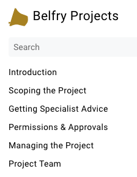
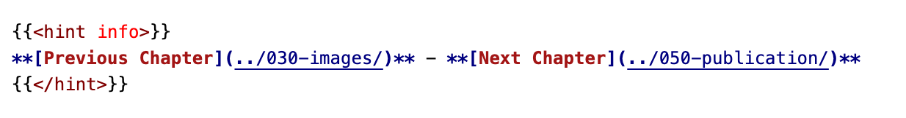

# Navigation Menus

This chapter cover the navigation menus - the clickable list of document chapters on the left side of the screen and the clickable list of sections within the current chapter on the right side of the screen. (If you have a narrow browser window you will, of course need to click the menu bars at top left or right, as described in the [Introduction](../010-introduction/#how-do-you-use-hugo)). 


In our view, this extensive hyperlinking removes the need for a conventional contents list or an index.


We will use the *Belfry Projects* document (as at the time of writing) as an example.

## Chapter Menu

Figure 1 shows the first five chapters of the left-hand menu.



*Figure 1: First part of the chapters menu*

How does Hugo know in what order the chapters should appear? They do appear in the order of the chapter folders in a directory listing or in the online repository but, as we said in [Files & Folders](../015-files-and-folders), that is because we have - for convenience - started each folder name with a three digit code which has no meaning to Hugo. The answer lies in some Markdown code at the top of each chapter. In the 'Introduction' chapter of *Belfry Projects* this is:

```
---
title: Introduction
weight: 10
---

# Introduction
```

Between the two rows of dashes are 'title' and 'weight'. These are Hugo parameters:
 - 'title' provides the text which will appear in the left hand navigation menu.
 - 'weight' controls the order in which the chapters appear - the higher the weight, the lower down the list.


**Style Tips**:
 1. Note that we are using a Level 1 heading to provide a title for the chapter. This does not need to be identical to the title parameter. If you click on 'Files & Folders' in this document you will see that the title on the chapter page is 'Files and Folders'. This is a useful way of shortening the menu entry to make it look neater. The ampersand is useful here.
 2. Note we also use the same weight as our 'for convenience' numbering of the folder. This is not essential but it is useful to increase these numbers initially by 10 to make adding extra chapters easier.


## Section Menu

This is the right hand menu. As you can see from any of the online documents, including this one, this menu provides links to sections within the current chapter, taking the text from the section headings. The following points should be noted:

 - The Level 1 heading, which we have used as a chapter title, is not included.
 - The headings are listed in the order in which they appear in the chapter.
 - The menu is indented to a level of two. In other words only the Level 2 and 3 headings are shown, although higher levels can be used.


It is not clear if the two level limit can be increased. Our judgement, however, is that an increased number of level would over-complicate the menu.


## End of Chapter Menu

At an early stage of development, it was suggested that it would be convenient if 'previous' and 'next' links could be included at the end of chapters. This would be useful for someone who simply wanted to read through the document - especially if they were reading on a narrow screen without the navigation menus on-screen. Example code for this chapter is shown in Figure 2...



*Figure 2: Example of the code for the end of chapter menu*

... and the result can be seeen, and tested, below:


## Disclaimer
 
*Whilst every effort has been made to ensure the accuracy of this information, neither contributors nor the Central Council of Church Bell Ringers can accept responsibility for any inaccuracies or for any activities undertaken based on the information provided.*

Version 0.1, August 2023

© 2023 Central Council of Church Bell Ringers
