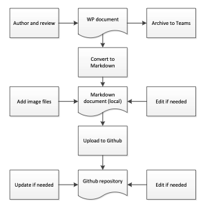
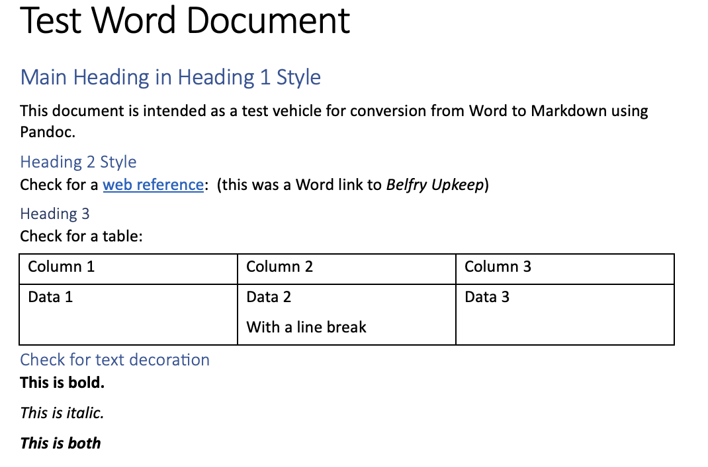

# Workflow

In between the idea in an author's mind and final publication online, the content of an online document will go through several different formats. We describe here the different formats, covering:

 - The advantages and disadvantages of various formats.
 - The conversion from one format to another.
 - The identification of a 'definitive version' of a document for audit and archive purposes.

 
 This chapter defines an ideal workflow. Because of the way that the existing documents were produced, we cannot guarantee that, at present, this workflow has been followed strictly, especially in the maintaining of archive copies and records of review. We hope to remedy this in the future.
 

## Details of the Workflow

The stages of a typical workflow are shown in Figure 1:



*Figue 1: Stages of a typical workflow*

### WP document

It is almost inevitable that the first draft of a document will be written using a Word Processor (WP) - typically Word, although other applications are available. Authors and reviewers may not be familiar with Markdown and a WP offers many useful authoring features, for example layout, cut and paste, and - perhaps most important - spell and grammar checking. For credibility, the document will require independent review and the 'track changes' features in modern WPs will provide an auditable summary of the review process. The final version of the WP document, including details of the review, will be archived to MS Teams.

### Conversion to Markdown

Once an agreed version has been produced in Word, it must be converted to Markdown for input to Hugo. This can be done in software, or manually. We describe these options here.

#### Conversion by software

The most common software for file conversion is [Pandoc](https://pandoc.org), which claims to be a universal document converter. This requires the program to be installed on your device - it is available for MacOS, Windows or Linux. There is no graphical interface - it is operated through a terminal window. You may need advice on how to set up and use this.

Figure 2 shows a short Word file (test-word.docx) used as a test:



*Figure 2: Word file used as test for Markdown conversion*

The simplest option in Pandoc for conversion to a Markdown file called test-md.md is the following Pandoc code:

```
pandoc test-word.docx -s -o test-md.md
```

After running this, the file test-md.md will contain the following code:

```
---
title: Test Word Document
---

# Main Heading in Heading 1 Style

This document is intended as a test vehicle for conversion from Word to
Markdown using Pandoc.

## Heading 2 Style

Check for a [web reference](https://belfryupkeep.cccbr.org.uk/): (this
was a Word link to *Belfry Upkeep*)

### Heading 3

Check for a table:

+----------+-------------------+----------+
| Column 1 | Column 2          | Column 3 |
+==========+===================+==========+
| Data 1   | Data 2            | Data 3   |
|          |                   |          |
|          | With a line break |          |
+----------+-------------------+----------+

## Check for text decoration

**This is bold.**

*This is italic.*

***This is both***
```

You will see that the software has not done badly. It correctly identified:

- Document title
- Heading levels
- Link to a web reference
- Text decoration

It produced a table but, as we saw [earlier](../020-markdown/#tables), this would not render correctly, as it has more than one line within a table cell. Also, links to other chapters in the same document would not work using a hyperlink within the WP file.


While not shown here, the conversion would not handle images, as these are in separate files. We believe there is a way around this by using the more exotic features of Pandoc, but we have not investigated this.


#### Manual conversion

An alternative is to copy and paste text from the WP document directly into an editor - either an editor on your own device or directly into the Github editor.


It may help if you have two screens open, with the WP document on one and the editor on the other.


Experience has shown that the most effective way is to do this by transferring one paragraph or heading at a time, adding appropriate Markdown for headings, text decoration, links and so on within the editor.

#### Conversion - conclusion

While software conversion seems attractive, it will be necessary to check and possibly carry out additional editing on the resulting file, for the reasons given [above](#conversion-by-software). This is a matter of personal choice but manual conversion may be more efficient. 


Experience also shows that the need to examine the text closely during manual conversion sometimes reveals minor errors missed in the preparation of the original WP document. (Although this is no excuse for not checking properly in the first place!)


### Markdown document

We strongly recommend that the Markdown document resulting from conversion is initially stored locally, usually on the personal device of the individual executing the workflow. At this point, any image files will be added to the folder and the content edited further if needed. Publishing on a [local server](../050-publication/#publishing-on-local-server) is very useful here.


While carrying out detailed work on local devices is convenient, it goes against the Workgroup ethos of maintaining files centrally. When the Markdown document is ready for uploading, the file and any image files should be copied to MS Teams as an archive. (Note that Markdown files archived within Teams need to be renamed as .txt files, as Teams does not know what to do with a .md file. )


### Upload to GitHub

This stage is covered [here](../050-publication/#publishing-from-github). 

### GitHub repository

Ideally, this is the final point. But there may be a need for further changes:
 - Even with thorough checking, typos may slip through and noticed only in the published document.
 - Exposed to a wider readership, technical points may be raised which require minor edits or possibly more major updates.

GitHub incorporates an editor and it is possible (and very quick and convenient) to make changes like this by directly editing the GitHub repository and committing the changes. But this raises the issue of a 'definitive version' of the document, discussed in the following section.

## Definitive Version

### The challenge

Assume that a 'chapter' of a document is uploaded to GitHub and [published](../050-publication) online. We need to note that there are now four versions of that chapter:
 1. The WP version.
 2. A version converted to Markdown, held locally or, ideally, in MS Teams.
 3. A Markdown version held in GitHub.
 4. A published version available online - which will be identical in content to 3, but in a more readable form.

As noted above, versions 2 and 3 may differ from version 1, in format and as minor corrections are made. Also, with time and experience, [version 3](#github-repository) may change in more substantial ways.

The challenge, therefore, is:
 - How to identify the 'definitive version' of a document.
 - Identifying what level of independent review should be applied to any change.

### Possible solutions

#### Keep whole workflow updated

Any changes made to the Markdown versions would be duplicated in the original WP version and submitted to reviewers for comment before loading onlnine.

*We suggest that this is not realistic, given the range of volunteers who might be involved in maintaining the documents. It also limits the ability to react rapidly to suggestions or new developments. An attempt to impose this would likely be ignored in detail, if not completely.*

#### Define the online version as 'definitive'

This would not involve updates to the original WP document, although there is a good argument to retain this as a record of the original intentions.

*A possible argument against this is the lack of a backup copy of the definitive document, since the only copy is in the GitHub repository. Given the widespread use of GitHub, however, we  suggest that we must regard that copy as safe - probably safer than on many other backup devices. It is possible to 'clone' a repository to another device so there may be an argument to do that periodically - possibly to Microsoft Teams.*

*There still remains, however, the difficulty of demonstrating an appropriate level of independent review for any changes. We discuss that in the following section.*

### Level of independent review

We suggest that 'simple' changes - correcting a typo or a cosmetic change to wording, for example - do not require review, while adding additional material or major corrections might need review.

All of the chapters in the current documents include a date in the format 'Month Year' and a version number in either two or three level digital form (for example 'Version 1.5' or 'Version 1.1.6'). The level of numbering was intended to indicate the significance of the change, although that has not been defined formally. If those levels were defined and agreed, that might provide a basis for what level of review (if any) is needed. Clearly, this requires further discussion.

## Arrangements for Reviewing

The concept of 'Reviewing' appears in the Workflow and needs to be considered here. Workgroup members are volunteers, usually very busy people. The result is that it has not always been easy to find reviewers, with the result that the review process has not always been rigorous or  well documented - *mea culpa*. The following is offered as a possible solution:

 1. A 'Review Board' is set up for each online document.
 2. It should consist of not more than 3 people.
 3. The members will usually be WG members, although other experts could be included.
 4. The members will undertake to review the initial draft of any document and any changes meeting the [agreed level of review](#level-of-independent-review).
 5. Results and outcomes of reviews will be archived in MS Teams.
 6. The members will also undertake to provide suggestions for additions or changes based on experience, articles in the RW or other sources, but will not provide content (to retain their independent status).

# Use of Teams

Possible section covering value of Teams in sharing documents. If all reviewers use Teams (see previous section) we would automatically have a record of comments, responses, changes, etc.

But poor take-up of Teams by WG. Would 'Review Board' have to be all committed to use of Teams??

----


**[Previous Chapter](../050-publication/)**


-----

## Disclaimer
 
*Whilst every effort has been made to ensure the accuracy of this information, neither contributors nor the Central Council of Church Bell Ringers can accept responsibility for any inaccuracies or for any activities undertaken based on the information provided.*

Version 0.2, May 2024

© 2024 Central Council of Church Bell Ringers
